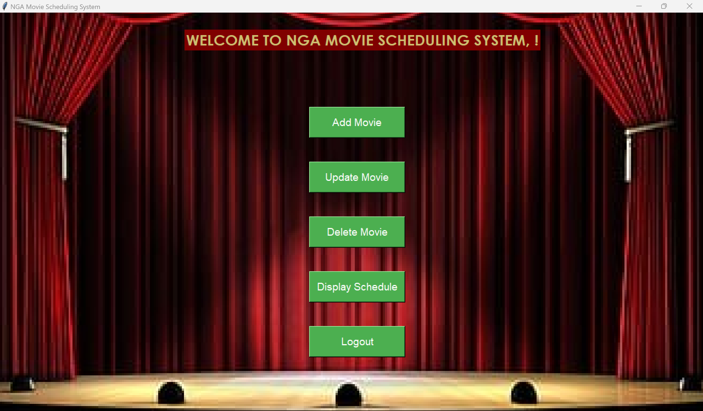

# Movie Scheduling System 🍿

## Description :page_with_curl:

The Movie Scheduling System is a Tkinter-based desktop application that allows users to manage and schedule movies. Users can register, log in, add movies, update movie details, delete movies, and view personalized and recommended movie schedules. The application connects to a MySQL database to store user and movie information.

## Features :movie_camera:

- User Registration and Login
- Add New Movies
- Update Existing Movies
- Delete Movies
- Display Movie Schedule
- Display Recommended Movie Schedule

## Installation :wrench:

### Prerequisites

- Python 3.x
- Tkinter (usually included with Python)
- MySQL

### Steps

1. Clone the repository:

   ```sh
   git clone https://github.com/yourusername/movieschedulingapp.git
   cd movieschedulingapp
2. Install required Python packages:

    ```sh
    pip install mysql-connector-python
    pip install customtkinter
3. Set up the MySQL database:

    - Create a MySQL database named try.

    - Create a table emp_db with the following schema:
    
        ```sql
        CREATE TABLE emp_db (
        ID INT PRIMARY KEY,
        UNAME VARCHAR(255) NOT NULL,
        PWD VARCHAR(255) NOT NULL
        );
4. Update the database connection credentials in the code:

    Edit main.py and update the MySQL connection details:
    
    ```python
        self.con = sq.connect(user='root', password='yourpassword', host='localhost', database='try')

## Usage :memo:

1. Run the main application:

    ```sh
        python main.py
2. Use the application to register/log in, manage movies, and view schedules.

    
    

    


## File Structure 📂

- main.py: The main application file.
- login_frame.py: The login frame class.
- register_frame.py: The registration frame class.
- main_window.py: The main window frame class.
- movie_input.py: The movie input frame class.
- movie_update.py: The movie update frame class.
- movie_delete.py: The movie delete frame class.
- movie_display.py: The movie display frame class.
- rec_movie.py: The recommended movie schedule - frame class.

## Contributing 🔗

1. Fork the repository.
2. Create a new branch (git checkout -b feature-branch).
3. Commit your changes (git commit -am 'Add new feature').
4. Push to the branch (git push origin feature-branch).
5. Create a new Pull Request.

## License
This project is licensed under the MIT License - see the [LICENSE]() file for details.

## Acknowledgements
Tkinter documentation: [Tkdocs](http://tkdocs.com/)

MySQL documentation: [MySQL](https://dev.mysql.com/doc/)

